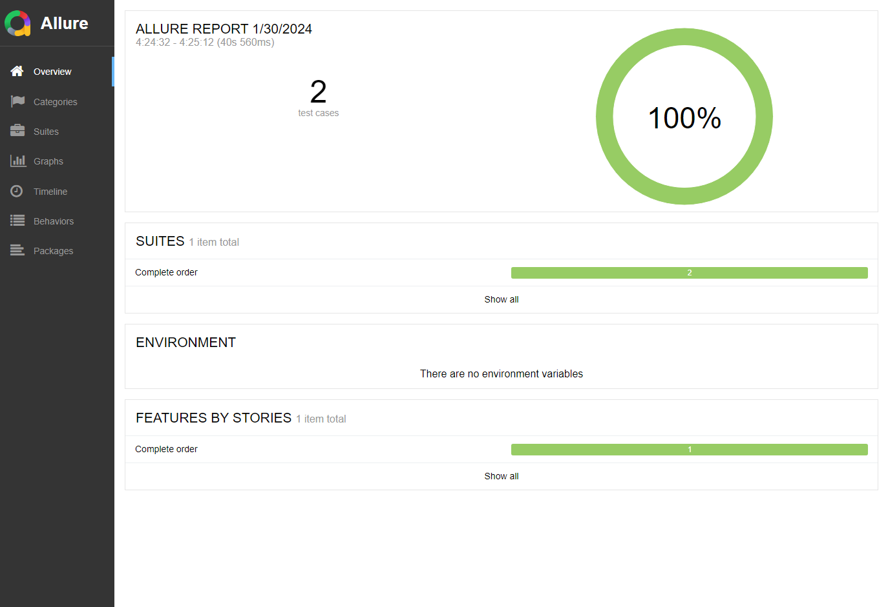

#Test Automation Framework Concept to test Magento website

The framework is created using Java, Maven, JUnit, Cucumber, Selenium, WebDriver, AllureReports. 
Principles and Patterns from Java and Automation like Page Object Model, Page Factory, Singleton, Dependency Injection were used in order to make the framework reusable and easy to upgrade and add more tests or functionalities.
## Getting started:

Prerequisites:

- Java 11 installed
- JAVA_HOME added to PATH
- Apache Maven 3.8.1 installed
- MAVEN_HOME added to PATH
- Allure installed for reports

## To run the tests:

1. Use Maven from command line
```
mvn clean test
```
2. Run the TestsRunner.java class in test/java/com/testing/magento/runners/

## To see reports:

1. Cucumber reports are created in target/cucumber-report. Open cucumber.html in browser.


2. Allure reports are created in target/allure-results. Run command:
```
allure serve target/allure-results
```
